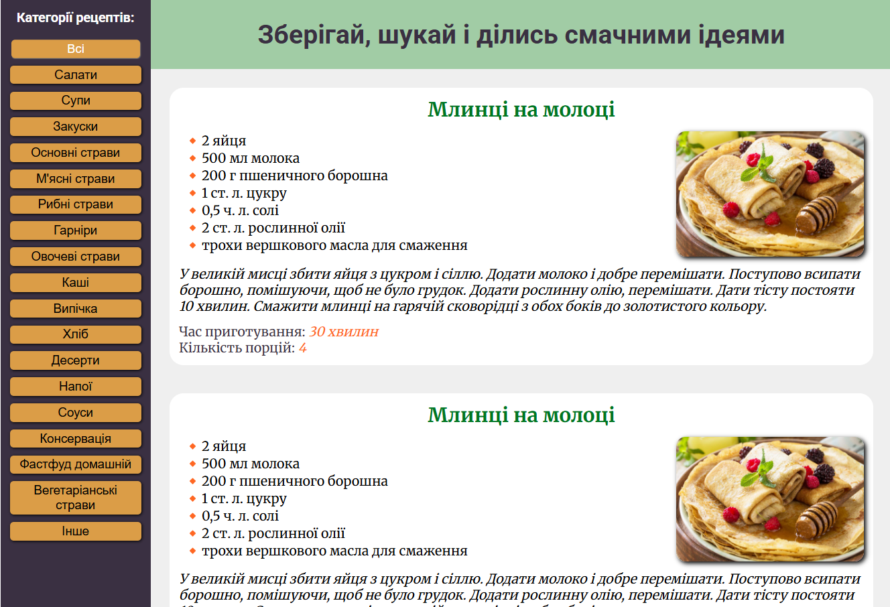
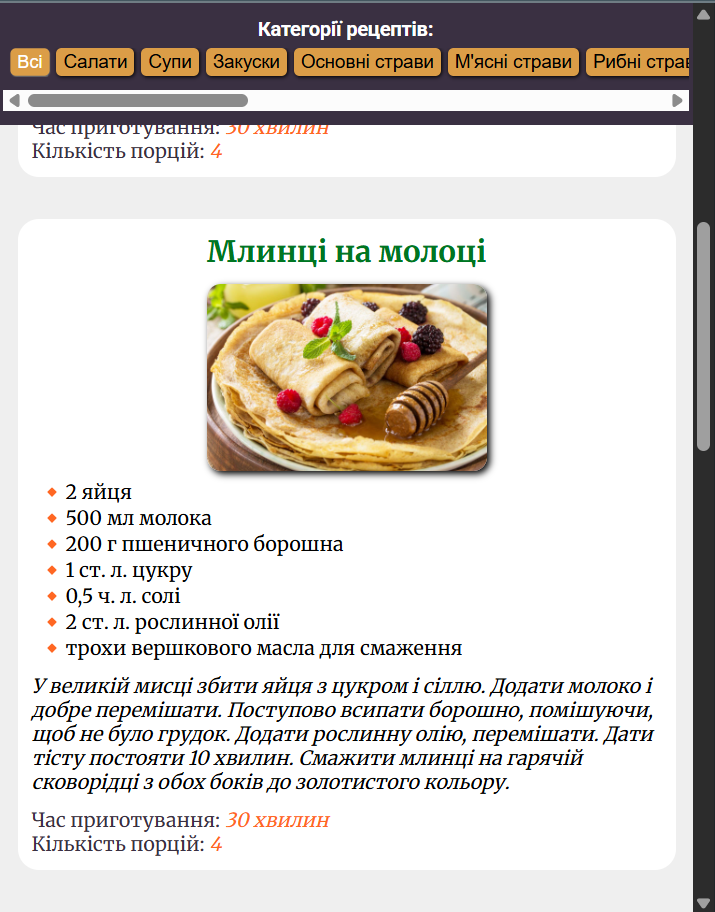

# 🍲 Cook Book Hub
Cook Book Hub is a web application for storing and browsing cooking recipes. The project is currently in active development, but you can already explore the interface and see how core features are being implemented.

🔗 Live Preview: [cook-book-hub](https://recipes-tau-lake.vercel.app/)

---

## 🛠️ Tech Stack:

* Vue 3
* Vercel Serverless API functions
* MongoDB
* Vee-validate + Yup

---

## 🚧 Upcoming Features
* **User Dashboard** – personal area where users can add, view, edit, and delete their own recipes
* **Registration and Login** – create an account to gain access to recipe management features
* **Recipe Comments** – allow users to comment on recipes and engage with others
* **Admin Panel** – tools to manage all recipes and users, with the ability to delete or block inappropriate posts and accounts
* **Contact Page** – a dedicated page for reaching out with questions, suggestions, or support requests
 
 ---

## Screenshots

    
    

